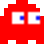
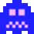
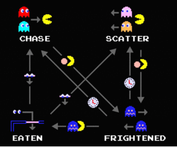

# Pacman-MP


A PacMan clone written in C++ using SFML, with local multiplayer support.

## Requirements for Building

- C++17 (or newer) toolset.
- Pre-built [SFML 2.6.x](https://www.sfml-dev.org/download/sfml/2.6.1/) or newer binaries. (Must match your Compiler and OS)
- [CMake 3.20+](https://cmake.org/download/) or newer (add it to PATH)

### For Windows

- MS Visual Studio 2019 or newer (NOT vscode), with default "**Desktop C++ Development**" workload.
- Please download "Visual C++ 64bit" edition of SFML; ignore others.
- Move your unzipped `SFML-2.6.x` folder to its own home, example: `C:/SFML/SFML-2.6.1`
- Make sure to edit [CmakeLists.txt](CMakeLists.txt) line 13, change value of `SMFL_HOME` to the directory you moved SFML into.

### For MacOS

- XCode latest (v13 or higher) from AppStore (with MacOS SDK)
- Apple Developer tools. After Xcode is installed, run this in your Terminal:
  ```bash
  sudo xcode-select --install
  ```
- Please install SFML 2.6 on your Mac as shown in [official macOS guide](https://www.sfml-dev.org/tutorials/2.6/start-osx.php).

### For Linux

- Use your OS package manager to download SFML 2.5 or newer.
- Alternatively, it's recommended to build SFML from source, see official docs.

## Building

- Please see [BUILDING.md](BUILDING.md) for build instructions.

## How it works

|             Player 1             |             Player 2             |             Blinky             |            Pinky             |            Inky            |            Clyde             |
| :------------------------------: | :------------------------------: | :----------------------------: | :--------------------------: | :------------------------: | :--------------------------: |
|  |  |  |  |  |  |

### Pacman

Pacman is the only player-controllable character in the game. He is the star of this show, and his goal is to eat all of the pellets inside the maze, all while avoiding being caught by the ghosts.

#### Gaining points

You may notice, however, that there are multiple types of "edible" tiles in the maze, such as regular pellets, which we'll call food, power pellets and fruit. Each kind of edible item has a different number of points associated to it, but not all are equally important. The game requires that pacman eats all FOOD tiles, meaning that Power Pellets and Fruits can very well remain uneaten and the game will still end if there are no more food tiles left.

| Icon                              | Tile Name        | Effect                                      |
| :-------------------------------- | :--------------- | :------------------------------------------ |
|         | Food             | Grants Pacman +5 extra points               |
|     | Power Pellet     | Grants Pacman the ability to "eat" ghosts\* |
|      | Fruit            | Grants Pacman +100 extra points             |
|  | Frightened Ghost | Grants Pacman +200 extra points             |

> - after pacman eats a power pellet, all ghosts will enter their frightened state for a short period of time, causing them to become vulnerable. Only when in this state will Pacman be able to eat the ghosts.

When Pacman comes in contact with a ghost, he will not lose a life, as the original game would make you think. Instead, he loses 200 points and enters a hurt state for a short period of time. This hurt state grants him full invincibility from the ghosts, with the downside that he can't eat any tiles either. This mode is there solely to give him an opportunity to run away and recover from a tough situation.

#### Controls

When playing in the single player mode, the controls for pacman are the `WASD` keys. In dual player mode, the second pacman is then bound to the arrow keys, like good old games used to do! 😉

### Ghosts

The ghosts are controlled by an "AI" algorithm, implemented to closely resemble the original one. Each ghost is unique, and we'll go into detail on how exactly they differ in just a second. Firstly, let's cover the common elements shared by all of them.

#### The state machine

<table>
<td>



> Credits: this image was extracted from [this youtube video](https://www.youtube.com/watch?v=ataGotQ7ir8)

</td>
<td>

All ghosts are implement as a finite state machine that consists of 4 main states:

- Chase
- Scatter
- Frightened
- Eaten

</td>
</table>

We'll leave chase mode for later, as that is actually the bit that differs amongst the ghosts, while the other 3 states are identical in terms of behaviour across the board.

##### Scatter State

When in scatter state, all ghosts will hurry back to their "safe spot" on the map instead of chasing Pacman. Each ghost has a different spot on the map, but conceptually, they all do the same thing, which is, they try to get to that spot on the map.

|                                | Ghost  | Scatter point                  |
| :----------------------------- | :----- | :----------------------------- |
|  | Blinky | Top right corner of the map    |
|    | Pinky  | Top left corner of the map     |
|      | Inky   | Bottom right corner of the map |
|    | Clyde  | Bottom left corner of the map  |

In actuality, the ghosts don't stay in scatter mode for long enough to reach or loop through their safe spot. Rather, the scatter mode is implemented as to give pacman a small break from constantly being chased.

###### Movement decision

The way the next tile to move into is decided is by calculating the distance from it to the destination target, linearly, with pythagoras theorem and then greedily picking the one that is the closest.

> Note: Ghosts can not turn around 180 degrees, so the only available tiles which are taken into account are the ones directly in front, to the right and the one to the left.

###### Possible transitions

The only way a ghost can enter scatter mode is if the ghost was previously in chase mode, and the chase mode timer reached 0 (i.e. after the amount of time alloted to being in chase mode has ran out).

From this state, the ghost can either go back into chase mode when the scatter timer reaches 0 (i.e. after the amount of time alloted to being in scatter mode has ran out) or go into frightened mode when pacman eats a power pellet.

##### Frightened State

When in the frightened state, all ghosts enter an identical behaviour of pseudo-random movement and change their appearance into alteranting blue and white colors.

> In this state, the ghost speed gets halved, giving pacman an advantage in catching them.

###### Movement decision

The next tile decision is now purely random (from the pool of available options\*), and is picked at each new tile.

> Note: Ghosts can not turn around 180 degrees, so the only available tiles which are taken into account are the ones directly in front, to the right and the one to the left.

###### Possible transitions

There are 2 ways a ghost can get out of the fightened state. Either the frightened timer runs out, in which case the ghost goes back into chase mode, or the ghost gets eaten, in which case it goes into the ... well ... eaten state.

The ghosts can only enter this state when pacman eats a power pellet.

##### Eaten State

When in eaten state, the ghost changes its appearance again to a floating set of eyes and attempts to run back to the ghost house at the middle of the maze. They cannot jurt pacman when in this state. They must first reach the ghost house in order to respawn.

> In this state, the ghost speed gets doubled as to reach the house as quickly as possible.

###### Movement decision

The way the next tile to move into is decided is by calculating the distance linearly, just like scatter mode and then greedily picking the best one.

In this state, the target tile is inside the ghost house.

> Note: Ghosts can not turn around 180 degrees, so the only available tiles which are taken into account are the ones directly in front, to the right and the one to the left.

###### Possible transitions

The only way out of the eaten state is for the ghost to reach the ghost house and get respawned. At that point, the ghost goes back to chase mode.

The only way a ghost can get into the eaten state is by coming in contact with pacman while it is in the frightened state.

##### Chase State

When in chase state, all ghosts will target a specific tile in the maze, based on pacmans position, and chase it. Each ghost has a different way of getting that tile, but conceptually, they all do the same thing, which is, they try to get to that spot on the map.

###### Blinky Chase Target

Blinky will always chase down pacman directly. His target tile is the tile that pacman is currently sitting on.

###### Pinky Chase Target

Pinky tries to be smart and catch pacman off-guard from the front, kinda teaming up with blinky to flank pacman and catch him. His target tile is the tile 4 tiles in front of pacman.

> In the original game, when pacman is facing up, a bit overflow bug caused pinky to chase the tile 4 tiles in front and 4 tile to the left of pacman. That bug has not been implemented here.

###### Inky Chase Target

Inky is the madlad tactician here as he has the most difficult tile to predict and is the only ghost that requires 2 positions in order to calculate his target. The tile inky targets is calculated by getting the tile 2 tiles in front of pacman and then getting a point symmetric to Blinky from there. Basically, if you draw a line from where Blinky is to the tile 2 tiles in front of Pacman and then rotate that line 180 degrees around the tile in front of pacman, that's where inky is headed.

While this tile choosing algorithm seems kind of random, it actually works out quite well in teaming up with Blinky. If Blinky is far from Pacman, this will cause Inky to flank Pacman from a diametrally opposite direction. If Blinky is on Pacmans tail, then Inky will get in close and personal too!

> Note, due to the same bit overflow bug mentioned above, in the original game, when pacman is facing up, the point in front of pacman is also 2 tiles to the left. That bug has not been implemented here.

###### Clyde Chase Target

Clyde is basically Blinky with anxiety. As long as Pacman is 8 or more tiles away from him, his target is just the same as Blikys target, i.e. the tile right under Pacman. If, however, he gets too close, his anxiety kicks in and his tile becomes the same as his scatter target, so he basically runs back home.

###### Possible transitions

A ghost can enter the chase state if it was previously in scatter state and the scatter timer reached 0, if it was previously in frightened mode and the frightened timer reached 0 or if it was in the eaten state and it reached the ghost house and has respawned.

A ghost can get out of chase state when the chase timer runs out, in which case it goes into scatter mode, or when Pacman eats a power pellet, in which case the ghost will get into frightened mode.
